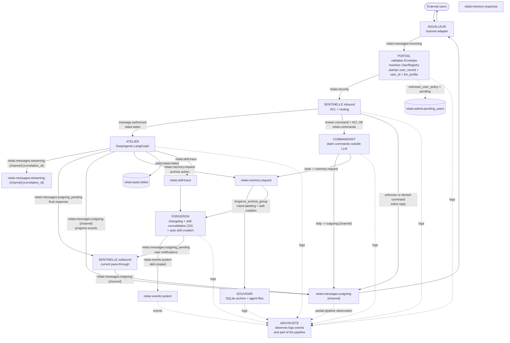

# RELAIS

RELAIS is a micro-brick architecture for an AI assistant, orchestrated via Redis Streams. This README describes the state actually implemented in the repository code today.

---

## Overview

Active bricks in the repo:

- `aiguilleur`: inbound/outbound channel adapters
- `portail`: envelope validation + identity resolution
- `sentinelle`: ACL and message/command routing
- `atelier`: LLM execution via DeepAgents/LangGraph
- `commandant`: slash commands outside the LLM
- `souvenir`: Redis short-term memory + SQLite archiving
- `archiviste`: logs and partial pipeline observation
- `forgeron`: autonomous skill improvement (direct SkillEditor rewrite) and automatic skill creation from archives
- `horloger`: CRON scheduler — fires scheduled prompts as virtual user messages through the full pipeline

Channel adapters actually shipped:

- **Discord**: full native Python adapter (`aiguilleur/channels/discord/adapter.py`)
- **WhatsApp**: full native Python adapter via the [fazer-ai/baileys-api](https://github.com/fazer-ai/baileys-api) gateway (`aiguilleur/channels/whatsapp/adapter.py`) — aiohttp webhook server + HTTP client to the gateway. Install, configure, and pair via CLI (`python -m aiguilleur.channels.whatsapp install|configure|uninstall`) or via the `relais-config` sub-agent's LangChain tools `whatsapp_install`, `whatsapp_configure`, `whatsapp_uninstall`. See [docs/WHATSAPP_SETUP.md](docs/WHATSAPP_SETUP.md).
- **REST**: HTTP/JSON + SSE adapter (`aiguilleur/channels/rest/adapter.py`) — exposes `POST /v1/messages` (Bearer API key) and an SSE stream for programmatic clients (CLI, CI, TUI). Interactive SSE playground at `GET /docs/sse`. Authentication via HMAC-SHA256 API keys declared in `portail.yaml`.

The channel configuration also covers `telegram` and `slack`, but their presence in config files does not guarantee a complete adapter exists in this repo.

Tools shipped in the repo:

- `tools/tui-ts/`: TypeScript terminal client (Bun + SolidJS + @opentui/core) — TUI with native SSE streaming. Run with `bun run src/main.tsx`.

---

## Architecture

### Simplified view

```
User
    │
    ▼
┌─────────────┐     ┌─────────────────────────────────────────────────────────┐
│  AIGUILLEUR │     │                     PIPELINE                            │
│  (channel)  │────▶│  PORTAIL ──▶ SENTINELLE ──▶ ATELIER ──▶ SOUVENIR       │
│  Discord    │     │  (identity)   (ACL)       (LLM loop)  (SQLite memory)   │
│  WhatsApp   │◀────│                  │                                       │
│  REST       │     │                  └──▶ COMMANDANT (slash commands)       │
└─────────────┘     └─────────────────────────────────────────────────────────┘
                                            │
                                            ▼ relais:skill:trace
                                      ┌──────────────┐
                                      │   FORGERON   │◀── relais:memory:request
                                      │  - changelog │
                                      │  - skill auto│
                                      │  - correction│──▶ skill-designer
                                      └──────────────┘
```

Each arrow corresponds to a **Redis Stream**. Each brick is an independent Python process. Communication is asynchronous and resilient: unacknowledged messages (`XACK`) remain in the PEL (Pending Entry List) and are automatically redelivered.

### Actual flow



### Key Redis Streams

| Stream | Producer | Consumer |
|--------|----------|----------|
| `relais:messages:incoming` | Aiguilleur | Portail |
| `relais:messages:incoming:horloger` | Horloger | Portail |
| `relais:security` | Portail | Sentinelle |
| `relais:tasks` | Sentinelle | Atelier |
| `relais:commands` | Sentinelle | Commandant |
| `relais:memory:request` | Atelier, Commandant | Souvenir (`souvenir_group`), Forgeron (`forgeron_archive_group`) |
| `relais:messages:outgoing_pending` | Atelier | Sentinelle |
| `relais:messages:outgoing:{channel}` | Sentinelle, Atelier, Commandant | Aiguilleur |
| `relais:messages:streaming:{channel}:{correlation_id}` | Atelier | streaming channel adapter |
| `relais:tasks:failed` | Atelier | observers / diagnostics |
| `relais:admin:pending_users` | Portail | manual review |
| `relais:skill:trace` | Atelier | Forgeron |
| `relais:memory:response:{correlation_id}` | Souvenir | Forgeron (BRPOP) |
| `relais:events:system` | Forgeron | Archiviste |
| `relais:logs` | all bricks | Archiviste |

### Brick behavior

- `Portail` consumes `relais:messages:incoming`, resolves the user via `UserRegistry`, writes `context["portail"]["user_record"]`, `context["portail"]["user_id"]` and `context["portail"]["llm_profile"]` (from `channel_profile` or `"default"`), then publishes to `relais:security`.
- `Sentinelle` consumes `relais:security`, applies ACLs, routes normal messages to `relais:tasks` and slash commands to `relais:commands`. Unknown or unauthorized commands generate a direct inline response on `relais:messages:outgoing:{channel}`.
- `Commandant` consumes `relais:commands`. `/help` responds with the list of available commands. `/clear` publishes a `clear` request to `relais:memory:request`. `/sessions` lists the user's recent sessions. `/resume <session_id>` resumes a previous session by loading its full history.
- `Atelier` consumes `relais:tasks`, manages conversational history via the persistent LangGraph checkpointer (`AsyncSqliteSaver`, `checkpoints.db`, keyed by `user_id`), optionally publishes streaming to `relais:messages:streaming:{channel}:{correlation_id}`, progress events to `relais:messages:outgoing:{channel}`, then the final response to `relais:messages:outgoing_pending`. Atelier supports a 2-tier sub-agent architecture: user sub-agents in `$RELAIS_HOME/config/atelier/subagents/<name>/` (one directory per sub-agent, with `subagent.yaml`, optional `tools/*.py`), and native sub-agents in `atelier/subagents/<name>/` (shipped with source). Shipped native sub-agents: `relais-config` (channel/profile configuration CRUD), `horloger-manager` (CRUD of Horloger job YAML files, accessible via `/horloger` or `/schedule`), and `skill-designer` (interactive SKILL.md creation from a user correction). Role access is controlled via `allowed_subagents` in `portail.yaml` (fnmatch patterns). Hot-reload supported for real-time modifications.
- `Souvenir` consumes `relais:memory:request` (actions: `archive`, `clear`, `file_write`, `file_read`, `file_list`, `sessions`, `resume`). The `archive` action is published by Atelier with the full turn content and `messages_raw` for archiving in SQLite. The `sessions` and `resume` actions return data to the user via `relais:messages:outgoing:{channel}` (with ownership enforcement). File actions are triggered by agents via `SouvenirBackend`. Short-term history is managed by the Atelier LangGraph checkpointer (keyed by `user_id:session_id`).
- `Archiviste` observes `relais:logs`, `relais:events:*` and a partial list of pipeline streams. It does not literally observe all streams.
- `Forgeron` has three autonomous pipelines:

  **Pipeline 1 — Improving existing skills** (direct edit)

  Consumes `relais:skill:trace` (`forgeron_group`). For each trace, Forgeron evaluates four trigger conditions per skill. Analysis fires as soon as **at least one** is true (and `edit_mode` is enabled):

  | Condition | Threshold | What is captured |
  |-----------|-----------|-----------------|
  | **Tool errors** | `tool_error_count >= edit_min_tool_errors` (default 1) | Turns where the agent failed |
  | **Aborted turn (DLQ)** | `tool_error_count == -1` | Turns aborted by `ToolErrorGuard` — `messages_raw` contains the partial conversation |
  | **Success after failure** | Current turn 0 errors, previous turn (same skill) had errors | The "correction turn" — where the agent found the right approach |
  | **Usage threshold** | `edit_call_threshold` cumulative calls (default 10) | Normal usage patterns, even without errors |

  A **Redis cooldown** per skill (`edit_cooldown_seconds`, default 300 s) prevents edit spam.

  `SkillEditor` receives the current SKILL.md + the conversation trace scoped to the target skill (`scope_messages_to_skill`), calls the LLM once (`edit_profile`, default `precise`) with `with_structured_output`, and rewrites SKILL.md directly if `changed=True`. For bundle skills, `skill_paths` in the trace context provides the absolute directory path.

  **Pipeline 2 — Automatic skill creation**

  Consumes `relais:memory:request` (`forgeron_archive_group`, independent fan-out from Souvenir). For each archived session:
  1. `IntentLabeler` (fast LLM) extracts a normalized intent label (e.g. `"send_email"`). If no clear pattern → stop.
  2. The session is recorded in SQLite with its label.
  3. When `min_sessions_for_creation` sessions (default 3) share the same label AND the creation cooldown has expired (default 24h):
     - `SkillCreator` (precise LLM) generates a complete `SKILL.md` from the representative sessions.
     - The `skill.created` event is published to `relais:events:system`.
     - Optional user notification via `relais:messages:outgoing_pending`.

  **Pipeline 3 — User correction → `skill-designer`**

  Also consumes `relais:memory:request` (`forgeron_archive_group`). The `IntentLabeler` can detect that a session is an **explicit user correction** (`is_correction=True`) rather than normal usage. In that case (and if `correction_mode` is enabled):
  1. Forgeron fetches the full session history from Souvenir via `relais:memory:response:{correlation_id}` (BRPOP).
  2. A notification is sent to the user informing them that a correction was detected.
  3. An `ACTION_MESSAGE_TASK` message is published to `relais:tasks` with `force_subagent = "skill-designer"` in the context. Atelier then delegates directly to `skill-designer`, which engages a dialogue with the user to create an appropriate `SKILL.md`.

---

## Available Commands

Slash commands are handled outside the LLM by **Commandant**. They all start with `/` and are routed before reaching Atelier.

| Command | Description |
|---------|-------------|
| `/help` | Displays the list of available commands. |
| `/clear` | Clears the current session history (Redis + SQLite). |
| `/sessions` | Lists your recent sessions with their identifiers. |
| `/resume <id>` | Resumes a previous session and loads its history. |
| `/bundle install <zip> \| uninstall <name> \| list` | Manages skill/tool bundles (install from ZIP, uninstall, or list installed bundles). |

**Access control**: commands authorized per role are declared in `roles.*.actions` in `portail.yaml`. `["*"]` grants access to all commands, `[]` denies all.

```yaml
# portail.yaml
roles:
  admin:
    actions: ["*"]        # all commands
  user:
    actions: ["clear", "sessions", "resume"]
  guest:
    actions: []           # no commands allowed
```

Unknown or unauthorized commands generate a direct inline response (without going through Atelier).

---

## Installation

### Prerequisites

- Python `>=3.11`
- `uv`
- `supervisord` if you want supervised launching
- Redis server (see installation below)

#### Installing Redis

RELAIS uses a Redis **Unix socket** (`./.relais/redis.sock`). Native Windows does not support Unix sockets — use WSL2 or Docker instead.

**macOS**
```bash
brew install redis
# Optional: start Redis as a background service
brew services start redis
```

**Linux — Debian / Ubuntu**
```bash
sudo apt update && sudo apt install redis-server
sudo systemctl enable --now redis-server
```

**Linux — RHEL / Fedora / CentOS**
```bash
sudo dnf install redis
sudo systemctl enable --now redis
```

**Linux — Arch**
```bash
sudo pacman -S redis
sudo systemctl enable --now redis
```

**Windows**
Redis has no official native Windows build. Two supported paths:

- **WSL2** (recommended): install Ubuntu via WSL2, then follow the Debian/Ubuntu steps above.
- **Docker**:
  ```bash
  docker run -d --name relais-redis \
    -v "$PWD/.relais:/data" \
    redis redis-server /data/redis.conf
  ```
  Make sure `config/redis.conf` bind-mounts correctly and that the socket path is reachable from the host.

After installing Redis, RELAIS starts it automatically via `supervisord` using `config/redis.conf` — you do not need to start it manually when using `./supervisor.sh`.

### Recommended path

```bash
git clone <repo-url>
cd relais

uv sync

cp .env.example .env

python -c "from common.init import initialize_user_dir; initialize_user_dir()"
```

### What initialization does

`initialize_user_dir()` creates `RELAIS_HOME` and copies all templates declared in `common/init.DEFAULT_FILES`, including:

- `config/config.yaml`
- `config/portail.yaml`, `config/sentinelle.yaml`
- `config/atelier.yaml`, `config/atelier/profiles.yaml`, `config/atelier/mcp_servers.yaml`
- `config/aiguilleur.yaml`
- `config/HEARTBEAT.md`
- shipped prompts (`prompts/soul/SOUL.md`, channels, policies, roles, users)

If `config/aiguilleur.yaml` is deleted afterwards, `load_channels_config()` logs a WARNING and falls back to a Discord-only minimal fallback.

### `RELAIS_HOME`

By default, `RELAIS_HOME` is `./.relais` at the repository root. You can override it with the `RELAIS_HOME` environment variable.

Configuration and prompts are read from `RELAIS_HOME`. The `skills`, `logs`, `media` and `storage` directories remain centered on `RELAIS_HOME`.

---

## Working directory structure

After initialization, the user directory looks like this:

```text
<RELAIS_HOME>/
├── config/
│   ├── config.yaml
│   ├── portail.yaml
│   ├── sentinelle.yaml
│   ├── atelier.yaml
│   ├── aiguilleur.yaml
│   ├── HEARTBEAT.md
│   └── atelier/
│       ├── profiles.yaml
│       ├── mcp_servers.yaml
│       └── subagents/          ← custom sub-agents (empty by default)
├── bundles/                    ← installed ZIP bundles
├── prompts/
│   ├── soul/
│   │   ├── SOUL.md
│   │   └── variants/
│   ├── channels/
│   ├── policies/
│   ├── roles/
│   └── users/
├── skills/
├── media/
├── logs/
├── backup/
└── storage/
    ├── memory.db
    └── horloger.db
```

`audit.db` is not a database currently managed by the code. Archiviste writes mainly to `logs/events.jsonl` and process logs.

---

## Configuration and hot-reload

### Hot-reload

All bricks support reloading their configuration without restarting.

**Mechanism:**
- Each brick watches its YAML configuration files via `watchfiles` (filesystem change detection)
- On each detected change, the configuration is reloaded and validated atomically
- On YAML error, the previous configuration is preserved (safe fallback)
- Reloaded configurations are archived in `~/.relais/config/backups/{brick}_{timestamp}.yaml` (max 5 versions per brick)
- Operators can also trigger reload manually via Redis Pub/Sub by sending `"reload"` on `relais:config:reload:{brick_name}`

**Files watched per brick:**
- **Portail**: `config/portail.yaml` (users, roles, policies)
- **Sentinelle**: `config/sentinelle.yaml` (ACLs, groups)
- **Atelier**: `config/atelier.yaml`, `config/atelier/profiles.yaml`, `config/atelier/mcp_servers.yaml`
- **Souvenir**: no watched files — no reloadable config
- **Aiguilleur**: `config/aiguilleur.yaml` (channel definitions)

**Use cases:**
- Modifying ACLs (Sentinelle) without restart
- Adding/removing LLM profiles (Atelier) live
- Changing user policies (Portail)
- Enabling/disabling channels (Aiguilleur)

### `config/config.yaml`

The runtime currently reads mainly `llm.default_profile` from this file, via `common.config_loader.get_default_llm_profile()`.

Minimal faithful example:

```yaml
llm:
  default_profile: default
```

The shipped template also contains `redis`, `logging`, `security` and `paths` blocks, but the current execution path relies primarily on environment variables for Redis and runtime paths.

### `config/portail.yaml`

This file drives user identity and unknown user policy.

Key points:

- `unknown_user_policy`: `deny`, `guest` or `pending`
- `guest_role`: role used if `unknown_user_policy=guest`
- `users.*.prompt_path`
- `roles.*.prompt_path`
- `roles.*.skills_dirs`
- `roles.*.allowed_mcp_tools`
- `roles.*.allowed_subagents`

Reduced example:

```yaml
unknown_user_policy: deny
guest_role: guest

users:
  usr_admin:
    display_name: "Administrator"
    role: admin
    blocked: false
    prompt_path: null
    identifiers:
      discord:
        dm: "123456789012345678"
        server: null

roles:
  admin:
    actions: ["*"]
    skills_dirs: ["*"]
    allowed_mcp_tools: ["*"]
    allowed_subagents: ["*"]
    prompt_path: null
  guest:
    actions: []
    skills_dirs: []
    allowed_mcp_tools: []
    allowed_subagents: []
    prompt_path: null
```

### `config/sentinelle.yaml`

Sentinelle does not resolve identity. It reads `user_record` from the envelope enriched by Portail and applies its ACL rules.

Example:

```yaml
access_control:
  default_mode: allowlist
  channels: {}

groups: []
```

### `config/atelier.yaml`

This file drives event publication to the channel.

```yaml
display:
  enabled: true
  final_only: true
  detail_max_length: 100
  events:
    tool_call: true
    tool_result: true
    subagent_start: true
    thinking: false
```

### `config/atelier/profiles.yaml`

The loader reads these fields:

- `model`
- `temperature`
- `max_tokens`
- `base_url`
- `api_key_env`
- `fallback_model`
- `max_turns`
- `mcp_timeout`
- `mcp_max_tools`
- `resilience.retry_attempts`
- `resilience.retry_delays`
- `resilience.fallback_model`

Minimal example:

```yaml
profiles:
  default:
    model: anthropic:claude-haiku-4-5
    temperature: 0.7
    max_tokens: 1024
    base_url: null
    api_key_env: ANTHROPIC_API_KEY
    fallback_model: null
    max_turns: 20
    mcp_timeout: 10
    mcp_max_tools: 20
    resilience:
      retry_attempts: 3
      retry_delays: [2, 5, 15]
      fallback_model: null
```

`base_url` can use `${VAR}` interpolation. If the variable does not exist at load time, `load_profiles()` fails immediately.

### `config/atelier/mcp_servers.yaml`

The current loader reads the `mcp_servers.global` and `mcp_servers.contextual` sections, with entries for `enabled`, `type`, `command`, `args`, `url`, `env`, `profiles`.

Example:

```yaml
mcp_servers:
  global:
    - name: filesystem
      enabled: true
      type: stdio
      command: npx
      args: ["-y", "@modelcontextprotocol/server-filesystem", "/tmp"]

  contextual:
    - name: code-tools
      enabled: true
      type: stdio
      command: npx
      args: ["-y", "@modelcontextprotocol/server-github"]
      profiles: [coder, precise]
      env:
        GITHUB_TOKEN: "${GITHUB_TOKEN}"
```

### `config/aiguilleur.yaml`

`load_channels_config()` loads this file via the config cascade. The template is copied by `initialize_user_dir()`. If deleted manually afterwards, a WARNING is logged and the code falls back to a minimal Discord-only fallback.

Example:

```yaml
channels:
  discord:
    enabled: true
    streaming: false

  telegram:
    enabled: false
    streaming: true
    profile: fast

  whatsapp:
    enabled: false          # enable in ~/.relais/config/aiguilleur.yaml
    streaming: false        # baileys-api does not support streaming in MVP
    profile: default
    prompt_path: "channels/whatsapp_default.md"
    max_restarts: 5
```

Key points:

- `streaming` is read by each adapter and stamped into `context.aiguilleur["streaming"]`; Atelier reads this value per message (no startup cache)
- `profile` forces an LLM profile for all messages from the channel
- `prompt_path` forces a channel prompt overlay (Layer 4)
- `type: external`, `command`, `args`, `class_path` and `max_restarts` are supported by the adapter supervisor

> WhatsApp channel installation and configuration (baileys-api gateway install, API key creation, QR pairing) are handled end-to-end by the `relais-config` sub-agent via the `channel-setup` and `whatsapp` skills. See [docs/WHATSAPP_SETUP.md](docs/WHATSAPP_SETUP.md) for the manual step-by-step guide.

### `config/horloger.yaml`

Controls the CRON scheduler. Job specs are stored as individual YAML files in `jobs_dir` (one file per job).

```yaml
tick_interval_seconds: 30       # how often the scheduler checks for due jobs
catch_up_window_seconds: 120    # jobs older than this are skipped (not bulk-fired) after downtime
jobs_dir: "config/horloger/jobs"
db_path: "storage/horloger.db"
```

Jobs are managed via the `horloger-manager` native sub-agent (accessible via `/horloger` or `/schedule` slash command) or by manually creating YAML files in `jobs_dir`.

---

## Prompts

The system prompt is assembled by `atelier.soul_assembler.assemble_system_prompt()` in 4 layers, in this order:

| # | Source | Path configured in |
|---|--------|--------------------|
| 1 | `prompts/soul/SOUL.md` | always loaded |
| 2 | role overlay | `roles[*].prompt_path` in `portail.yaml` |
| 3 | user override | `users[*].prompt_path` in `portail.yaml` |
| 4 | channel overlay | `channels[*].prompt_path` in `aiguilleur.yaml` |

All paths are **explicit** (read from YAML configuration, not inferred by convention). Missing or empty files are silently ignored. Present layers are joined with `\n\n---\n\n`.

How these paths transit through the pipeline:
- Portail reads `portail.yaml`, resolves the `UserRecord` and includes `role_prompt_path` (from `roles[*].prompt_path`) and `prompt_path` (from `users[*].prompt_path`).
- Aiguilleur stamps `channel_prompt_path` into `context["aiguilleur"]` from `aiguilleur.yaml`.
- Atelier reads these three fields on each turn to call `assemble_system_prompt()`.

The `prompts/policies/*.md` files (e.g. `vacation.md`, `in_meeting.md`) are shipped in the repo but **are not automatically assembled** into the prompt — they exist as templates to be referenced manually in a role or user `prompt_path`.

---

## Environment Variables

Variables useful to the current runtime are detailed in [docs/ENV.md](docs/ENV.md). The most important:

- `RELAIS_HOME`
- `REDIS_SOCKET_PATH`
- `REDIS_PASSWORD`
- `REDIS_PASS_AIGUILLEUR`
- `REDIS_PASS_PORTAIL`
- `REDIS_PASS_SENTINELLE`
- `REDIS_PASS_ATELIER`
- `REDIS_PASS_SOUVENIR`
- `REDIS_PASS_COMMANDANT`
- `REDIS_PASS_ARCHIVISTE`
- `REDIS_PASS_FORGERON`
- `ANTHROPIC_API_KEY`
- `OPENROUTER_API_KEY`
- `RELAIS_DB_PATH`
- `DISCORD_BOT_TOKEN`
- WhatsApp channel (optional): `WHATSAPP_GATEWAY_URL`, `WHATSAPP_PHONE_NUMBER`, `WHATSAPP_API_KEY`, `WHATSAPP_WEBHOOK_SECRET`, `WHATSAPP_WEBHOOK_PORT`, `WHATSAPP_WEBHOOK_HOST`, `REDIS_PASS_BAILEYS`

For MCP examples shipped in templates, `GITHUB_TOKEN` and `BRAVE_API_KEY` may also be required depending on the enabled servers.

To enable WhatsApp, also install the optional dependencies: `uv sync --extra whatsapp` (adds `aiohttp>=3.9` and `qrcode>=7.0`).

---

## Starting

### Recommended option: supervisord

The most complete path in the repo is the `supervisord.conf` + `supervisor.sh` pair.

```bash
./supervisor.sh start all
./supervisor.sh [--verbose] start all
./supervisor.sh [--verbose] restart all
./supervisor.sh status
./supervisor.sh stop all
./supervisor.sh reload all
```

**`--verbose` flag**: After starting/restarting, follows all brick logs in real time. Press `Ctrl+C` to detach logs without stopping supervisord.

The wrapper:

- starts `supervisord` if needed
- launches local Redis via `config/redis.conf` (Unix socket + TCP port `127.0.0.1:6379` for ancillary services)
- starts bricks from the `infra`, `core` and `relays` groups: `portail`, `sentinelle`, `atelier`, `souvenir`, `forgeron`, `commandant`, `archiviste`, `aiguilleur`
- does **not** automatically start the `optional` group (which contains the `baileys-api` gateway for WhatsApp). WhatsApp channel installation/activation is driven by the `relais-config` sub-agent.

### Manual start

```bash
# Terminal 1
redis-server config/redis.conf

# Following terminals
uv run python portail/main.py
uv run python sentinelle/main.py
uv run python atelier/main.py
uv run python souvenir/main.py
uv run python forgeron/main.py
uv run python commandant/main.py
uv run python archiviste/main.py
uv run python aiguilleur/main.py
```

The Aiguilleur entry point is [aiguilleur/main.py](aiguilleur/main.py), not a separate `main.py` per channel. The currently implemented Discord adapter lives in [aiguilleur/channels/discord/adapter.py](aiguilleur/channels/discord/adapter.py).

### Local Redis note

The repo starts Redis with [config/redis.conf](config/redis.conf), which creates a Unix socket `./.relais/redis.sock` and per-brick ACLs. Brick passwords used via `.env` must remain aligned with this local configuration.

---

## Quick check

```bash
redis-cli -s ./.relais/redis.sock XLEN relais:messages:incoming
redis-cli -s ./.relais/redis.sock XLEN relais:security
redis-cli -s ./.relais/redis.sock XLEN relais:tasks
redis-cli -s ./.relais/redis.sock XRANGE relais:tasks - +
```

Useful logs:

- `./.relais/logs/events.jsonl`
- `./.relais/logs/*.log`

---

## Debug

All Python bricks go through [launcher.py](launcher.py) when launched via `supervisord.conf`. The wrapper supports:

- `DEBUGPY_ENABLED`
- `DEBUGPY_PORT`
- `DEBUGPY_WAIT`

Ports configured in `supervisord.conf`:

| Brick | Port |
|-------|------|
| `atelier` | `5678` |
| `portail` | `5679` |
| `sentinelle` | `5680` |
| `archiviste` | `5681` |
| `souvenir` | `5682` |
| `commandant` | `5683` |
| `aiguilleur` | `5684` |
| `forgeron` | `5685` |

---

## Tests

```bash
pytest tests/ -v
```

Particularly useful tests for verifying structural assertions:

- `tests/test_smoke_e2e.py`
- `tests/test_commandant_new_stream.py`
- `tests/test_channel_config.py`
- `tests/test_soul_assembler.py`

---

## Related documentation

- [docs/ARCHITECTURE.md](docs/ARCHITECTURE.md): technical reference per brick and per stream
- [docs/ENV.md](docs/ENV.md): actually useful environment variables
- [docs/CONTRIBUTING.md](docs/CONTRIBUTING.md): contribution workflow
