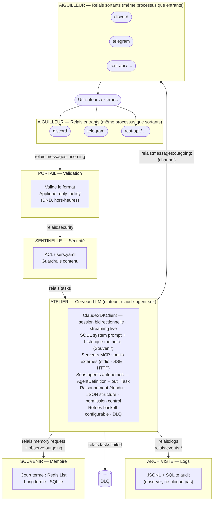

# RELAIS

RELAIS est une architecture micro-brique pour un assistant IA autonome et modulaire. Chaque brique gère une responsabilité spécifique et communique via Redis Streams, permettant un système flexible, résilient et facilement extensible.

---

## Architecture

### Diagramme ASCII

```
[Utilisateurs externes]
        │
        ▼
┌───────────────────────────────────────────────────────────────┐
│ AIGUILLEUR — Relais entrants                                  │
│  ┌────────────┐   ┌────────────┐   ┌────────────┐            │
│  │  discord   │   │  telegram  │   │  rest-api  │   ...      │
│  └─────┬──────┘   └─────┬──────┘   └─────┬──────┘            │
└────────┼────────────────┼────────────────┼────────────────────┘
         └────────────────┴────────────────┘
                          │ relais:messages:incoming
                          ▼
┌─────────────────────────────────────────────────────────────┐
│ PORTAIL — Validation des messages entrants                  │
│  Consomme : relais:messages:incoming                        │
│  Valide le format, applique reply_policy (DND, hors-heures) │
│  Produit  : relais:security                                 │
└─────────────────────────────────────────────────────────────┘
                          │
                    relais:security
                          │
                          ▼
┌─────────────────────────────────────────────────────────────┐
│ SENTINELLE — Sécurité                                       │
│  Consomme : relais:security                                 │
│  Vérifie les ACL (users.yaml), filtre le contenu            │
│  Produit  : relais:tasks                                    │
└─────────────────────────────────────────────────────────────┘
                          │
                     relais:tasks
                          │
                          ▼
┌─────────────────────────────────────────────────────────────────┐
│ ATELIER — Cerveau LLM  (moteur : claude-agent-sdk)              │
│  Consomme : relais:tasks                                        │
│  · Personnalité SOUL + historique Souvenir → system prompt      │
│  · ClaudeSDKClient — session bidirectionnelle, streaming live   │
│  · Routing LLM via proxy LiteLLM (ANTHROPIC_BASE_URL)           │
│  · Serveurs MCP : outils externes (stdio · SSE · HTTP)          │
│  · Sous-agents autonomes via AgentDefinition + outil Task       │
│    (profondeur contrôlée : max_agent_depth)                     │
│  · Raisonnement étendu, outils natifs, JSON structuré           │
│    (options SDK : thinking, output_format, effort…)             │
│  · Retries avec backoff configurable                            │
│  Produit  : relais:messages:outgoing:{channel}  (réponse)       │
│             relais:streaming:{channel}:{cid}    (chunks live)   │
│             relais:tasks:failed                 (DLQ)           │
└─────────────────────────────────────────────────────────────────┘
          │                        │                   │
   relais:messages:outgoing:{ch}   │            relais:logs /
          │                   relais:memory:*   relais:events:*
          ▼                        ▼                   ▼
┌───────────────────────┐  ┌──────────────┐   ┌──────────────┐
│ AIGUILLEUR            │  │   SOUVENIR   │   │  ARCHIVISTE  │
│  Relais sortants      │  │  Mémoire     │   │  Logs        │
│  ┌──────┐ ┌────────┐  │  │  court/long  │   │  JSONL +     │
│  │disco.│ │telegr. │  │  │  terme       │   │  SQLite      │
│  └──────┘ └────────┘  │  └──────────────┘   └──────────────┘
└──────────┬────────────┘
           │
           ▼
  [Utilisateurs externes]
```

> **Note :** les relais entrants et sortants sont le **même processus** par canal —
> `aiguilleur/discord/main.py` gère à la fois la réception (→ Redis) et l'envoi (Redis →).

---

### Diagramme Mermaid



---

## ATELIER — Moteur claude-agent-sdk

L'Atelier est la brique qui exécute l'intelligence. Il utilise **[claude-agent-sdk](https://github.com/anthropics/claude-code)** (`ClaudeSDKClient`) comme moteur d'exécution, ce qui lui donne accès à toute la puissance du modèle Claude au-delà d'un simple appel API.

### Capacités actives

| Capacité | Implémentation |
|----------|---------------|
| **Session bidirectionnelle** | `ClaudeSDKClient` — connexion streaming persistante, réponses chunk par chunk |
| **Personnalité SOUL** | System prompt multi-couche : `SOUL.md` + variantes canal/contexte, assemblé par `soul_assembler` |
| **Mémoire conversationnelle** | Historique court-terme injecté depuis Souvenir avant chaque appel |
| **Serveurs MCP** | Outils externes via stdio, SSE ou HTTP — déclarés dans `mcp_servers.yaml`, filtrés par profil |
| **Sous-agents autonomes** | `AgentDefinition` + outil `Task` (implicite) — agents spécialisés avec modèle et MCP hérités, profondeur limitée par `max_agent_depth` |
| **Streaming live** | Chunks publiés en temps réel sur `relais:messages:streaming:{channel}:{cid}` → rendu progressif Discord / Telegram |
| **Profils LLM** | Modèle, température, max_turns, retries configurables par profil (`profiles.yaml`) |
| **Routing LiteLLM** | `ANTHROPIC_BASE_URL` → proxy LiteLLM → n'importe quel backend (Anthropic, OpenRouter, local) |
| **Resilience** | Retry avec backoff configurable ; messages non-récupérables → DLQ (`relais:tasks:failed`) |

### Options SDK disponibles (configurables)

Ces capacités sont exposées par `claude-agent-sdk` et peuvent être activées via `ClaudeAgentOptions` sans modifier l'architecture :

| Option SDK | Effet |
|------------|-------|
| `thinking` | Raisonnement étendu adaptatif (`"adaptive"`) ou budgeté (`budget_tokens`) — le modèle réfléchit avant de répondre |
| `effort` | Niveau de raisonnement global : `"low"` / `"medium"` / `"high"` / `"max"` |
| `output_format` | Réponse JSON structurée selon un schéma défini |
| `task_budget` | Budget tokens côté API — le modèle gère lui-même son économie de tokens |
| `max_budget_usd` | Plafond de coût par appel |
| `can_use_tool` | Callback async de permission fine par outil (requiert mode streaming) |
| `hooks` | Lifecycle hooks : `PreToolUse`, `PostToolUse`, `Stop`, `SubagentStop`… |
| `sandbox` | Isolation système de fichiers et réseau pour les outils d'exécution |
| `enable_file_checkpointing` | Rewind des modifications fichiers jusqu'à un checkpoint |
| `fork_session` / `resume` | Reprendre ou bifurquer une session existante par ID |

### Flux d'exécution simplifié

```
relais:tasks
    │
    ▼
[1] Résoudre le profil LLM  (profiles.yaml → modèle, max_turns, retries)
[2] Récupérer le contexte   (relais:memory:request → Souvenir → historique)
[3] Assembler le system prompt  (SOUL.md + variante canal)
[4] Charger les MCP servers  (mcp_servers.yaml, filtre profil)
[5] Charger les sous-agents  (AgentDefinition, max_agent_depth)
[6] Ouvrir ClaudeSDKClient  → query(prompt) → receive_response()
    │  AssistantMessage → chunks → stream_callback → relais:streaming:…
    │  ResultMessage (success) → continuer
    │  ResultMessage (échec)   → SDKExecutionError → DLQ
[7] Publier la réponse  → relais:messages:outgoing:{channel}
```

---

## Installation

### Prérequis

- Python ≥ 3.11
- Redis ≥ 5.0
- [`uv`](https://docs.astral.sh/uv/) (recommandé) ou `pip`
- Node.js (pour le CLI `claude`) : `npm install -g @anthropic-ai/claude-code`
- `supervisord` (optionnel, pour l'orchestration multi-processus)

### Étapes

```bash
# 1. Cloner le projet
git clone <repo-url>
cd relais

# 2. Installer les dépendances
uv sync
# ou : pip install -e .

# 3. Initialiser le répertoire utilisateur (~/.relais/)
#    Crée la structure et copie tous les fichiers de configuration par défaut
python -c "from common.init import initialize_user_dir; from pathlib import Path; initialize_user_dir(Path('.'))"

# 4. Appliquer les migrations SQLite (Souvenir)
alembic upgrade head

# 5. Configurer l'environnement
cp .env.example .env
# Éditez .env avec vos clés API
```

---

## Configuration

Tous les fichiers de configuration se trouvent dans `~/.relais/config/` après l'initialisation. Ne modifiez jamais les fichiers sous `./config/` directement — ils servent de modèles.

### Résolution de configuration (cascade)

`~/.relais/config/` → `/opt/relais/config/` → `./config/`

Le premier fichier trouvé est utilisé. `RELAIS_HOME` surcharge `~/.relais` (utile pour Docker ou multi-instance).

### Structure du répertoire utilisateur

```
~/.relais/
├── config/
│   ├── config.yaml          Configuration système principale
│   ├── litellm.yaml         Modèles LLM et proxy
│   ├── profiles.yaml        Profils LLM (température, tokens, résilience)
│   ├── users.yaml           Registre des utilisateurs et ACL
│   ├── reply_policy.yaml    Politique de réponse automatique
│   ├── mcp_servers.yaml     Serveurs MCP (outils externes)
│   └── HEARTBEAT.md         Tâches CRON planifiées
├── soul/
│   ├── SOUL.md              Personnalité principale de l'assistant
│   └── variants/            Variantes de personnalité
├── prompts/                 Templates de prompts par canal et contexte
├── storage/
│   ├── memory.db            Mémoire long-terme (SQLite, géré par Alembic)
│   └── audit.db             Journal d'audit
├── logs/
└── redis.sock               Socket Unix Redis
```

---

### `config.yaml` — Configuration système

```yaml
redis:
  unix_socket: ~/.relais/redis.sock   # Socket Unix Redis
  password: "${REDIS_PASSWORD}"

litellm:
  base_url: "http://127.0.0.1:4000"  # URL du proxy LiteLLM
  api_key: "${LITELLM_MASTER_KEY}"

logging:
  level: INFO          # DEBUG | INFO | WARNING | ERROR
  format: text         # "text" (dev) | "json" (production)
  rotation: daily
  retention_days: 30

llm:
  default_profile: default   # Profil utilisé si l'utilisateur n'en a pas de spécifique

security:
  session_ttl: 86400        # Durée de vie session (secondes)
  max_message_size: 8192    # Taille max message entrant (octets)

paths:
  backup: ~/.relais/backup
  media:  ~/.relais/media
  skills: ~/.relais/skills
  logs:   ~/.relais/logs
```

---

### `litellm.yaml` — Proxy LLM

LiteLLM est un proxy transparent entre les briques et les fournisseurs LLM. Atelier envoie toutes ses requêtes à `ANTHROPIC_BASE_URL` et LiteLLM les route vers le bon backend.

**Lien critique :** le champ `model` dans `profiles.yaml` doit correspondre exactement à un `model_name` ici.

```yaml
model_list:

  # Modèle local (LM Studio, Ollama, vLLM...)
  - model_name: mon-modele-local        # ← doit matcher profiles.yaml:model
    litellm_params:
      model: openai/mon-modele-local    # ⚠️ OBLIGATOIRE : préfixe "openai/" requis pour tout
                                        # endpoint compatible OpenAI (LM Studio, Ollama, vLLM).
                                        # Sans ce préfixe, LiteLLM ne peut pas identifier le
                                        # provider et rejette le déploiement au démarrage.
      api_base: http://192.168.1.x:1234/v1
      api_key: lm-studio                # Clé factice requise mais ignorée en local

  # Modèle cloud via OpenRouter
  - model_name: mistral-small-2603
    litellm_params:
      model: openrouter/mistralai/mistral-small-3.1-24b-instruct
      api_key: os.environ/OPENROUTER_API_KEY

  # Modèle Anthropic direct
  - model_name: claude-sonnet-4-5
    litellm_params:
      model: anthropic/claude-sonnet-4-5
      api_key: os.environ/ANTHROPIC_API_KEY

general_settings:
  master_key: sk-changeme        # = LITELLM_MASTER_KEY dans .env
                                 # ⚠️  Cette valeur DOIT être identique à ANTHROPIC_API_KEY dans .env
                                 # et dans supervisord.conf (ANTHROPIC_API_KEY de la brique atelier).
                                 # Le CLI claude envoie ANTHROPIC_API_KEY comme clé d'authentification
                                 # au proxy LiteLLM. Si les deux ne correspondent pas → 400 Bad Request.
  store_model_usage: false
  disable_on_error_types:
    - "RateLimitError"

router_settings:
  routing_strategy: latency-based-routing   # latency-based-routing | simple-shuffle | least-busy
  enable_pre_call_checks: true
```

Pour lancer le proxy manuellement :
```bash
uv run --with "litellm[proxy]" litellm --config ~/.relais/config/litellm.yaml --port 4000
```

---

### `profiles.yaml` — Profils LLM

Chaque profil définit le comportement LLM pour une catégorie d'usage. Le profil actif est déterminé par `llm.default_profile` (config.yaml) ou par `llm_profile` dans l'entrée de l'utilisateur (users.yaml).

```yaml
profiles:
  mon-profil:
    model: mon-modele-local     # Doit correspondre à un model_name dans litellm.yaml
    temperature: 0.7            # 0.0 (déterministe) → 1.0 (créatif)
    max_tokens: 1024
    stream: false               # true = streaming progressif vers Discord/Telegram

    memory:
      short_term_messages: 20   # Nb de messages injectés dans le contexte (0 = désactivé)

    resilience:
      retry_attempts: 3
      retry_delays: [2, 5, 15]  # Délais en secondes entre tentatives
      fallback_model: null      # Modèle de repli si tous les retries échouent

    # Champs optionnels (subagents)
    max_turns: 10
    max_agent_depth: 2          # Profondeur max de récursion des subagents
    allowed_tools: null         # null = tous les outils autorisés
    allowed_mcp: null           # null = tous les serveurs MCP autorisés
    guardrails: []
    memory_scope: own           # "own" = mémoire par utilisateur | "global" = partagée
```

**Profils livrés par défaut :**

| Profil | Usage |
|--------|-------|
| `default` | Équilibre vitesse/qualité |
| `fast` | Réponses courtes, latence minimale |
| `precise` | Raisonnement approfondi, réponses longues |
| `coder` | Génération et révision de code |
| `memory_extractor` | Usage interne (Souvenir) — ne pas modifier |

---

### `users.yaml` — Registre des utilisateurs (ACL)

Chargé par la Sentinelle. Détermine si un utilisateur est autorisé et quel profil LLM lui est assigné.

```yaml
users:
  usr_mon_utilisateur:
    display_name: "Prénom Nom"
    role: user                            # "admin" | "user"
    channels: ["discord", "telegram"]     # Canaux autorisés ("*" = tous)
    blocked: false
    llm_profile: default
    identifiers:
      discord: "123456789012345678"       # ID Discord (entier, pas le username)
      telegram: "987654321"               # chat_id Telegram
    notes: "Commentaire libre"

default_policy:
  allow: false                  # false = refus des utilisateurs non enregistrés
  llm_profile: fast
  max_messages_per_hour: 10
```

**Rôles :**
- `admin` : accès à tous les canaux, toutes les commandes, guardrails désactivés
- `user` : accès limité aux canaux déclarés, guardrails actifs

> `usr_system` est un compte interne utilisé par les briques — ne pas supprimer.

---

### `reply_policy.yaml` — Politique de réponse automatique

Chargé par le Portail. Détermine si un message entrant doit être traité ou ignoré.

```yaml
reply_policy:
  enabled: true

  channels:
    - discord
    # - telegram
    # - whatsapp

  blocked_users: []             # user_id refusés sans réponse

  debounce_seconds: 2           # Anti-flood : délai min entre deux réponses au même utilisateur

  out_of_hours:
    enabled: false
    active_start: "08:00"       # Plage active (HH:MM)
    active_end: "22:00"
    timezone: "Europe/Paris"    # Fuseau tz database
    prompt_file: "prompts/out_of_hours.md"

  ignored_prefixes:
    - "!"                       # Commandes bots tiers
    - "/"                       # Slash commands

  min_message_length: 2
```

---

### `mcp_servers.yaml` — Serveurs MCP

Serveurs [Model Context Protocol](https://modelcontextprotocol.io) chargés par l'Atelier pour enrichir le contexte LLM avec des outils externes.

```yaml
mcp_servers:

  # Serveurs globaux — disponibles pour tous les profils
  global:
    - name: calendar
      url: "http://127.0.0.1:8100"
      transport: sse          # "sse" | "stdio" | "http"
      enabled: true

  # Serveurs contextuels — activés uniquement pour certains profils
  contextual:
    - name: brave-search
      url: "http://127.0.0.1:8101"
      transport: sse
      enabled: false
      profiles: [precise, coder]

timeout: 10     # Timeout des appels MCP (secondes)
max_tools: 20   # Nb maximum d'outils exposés au LLM par appel
```

**Transports :**
- `sse` : Server-Sent Events — serveur HTTP persistant (recommandé pour services distants)
- `stdio` : processus local via stdin/stdout (recommandé pour outils CLI)
- `http` : HTTP classique request/response

---

### `HEARTBEAT.md` — Tâches planifiées (CRON)

Chargé par le Veilleur. Définit les tâches automatiques récurrentes.

```yaml
tasks:
  - cron: "0 8 * * *"          # Expression CRON standard Unix (5 champs)
    task: daily_summary
    params:
      channel: discord
      llm_profile: default
      prompt: "Génère un résumé des activités de la journée passée."
    enabled: true

  - cron: "0 3 * * 1"
    task: backup
    params:
      destination: ~/.relais/backup/
      retention_days: 30
    enabled: true

  - cron: "0 2 * * 0"
    task: cleanup_logs
    params:
      max_age_days: 30
    enabled: true
```

**Types de tâches :**

| `task` | Description | Params requis |
|--------|-------------|---------------|
| `daily_summary` | Génère et envoie un résumé LLM | `channel`, `llm_profile`, `prompt` |
| `backup` | Sauvegarde `~/.relais/storage/` | `destination`, `retention_days` |
| `cleanup_logs` | Supprime les logs anciens | `max_age_days` |

Pour désactiver sans supprimer : `enabled: false`.

---

## Variables d'environnement (.env)

| Variable | Description | Exemple |
|----------|-------------|---------|
| `ANTHROPIC_BASE_URL` | URL proxy LiteLLM | `http://localhost:4000` |
| `ANTHROPIC_API_KEY` | LiteLLM master key — **doit être identique à `LITELLM_MASTER_KEY`** | `sk-changeme` |
| `LITELLM_MASTER_KEY` | Même valeur que `general_settings.master_key` dans `litellm.yaml` — **doit être identique à `ANTHROPIC_API_KEY`** | `sk-changeme` |
| `REDIS_SOCKET_PATH` | Path socket Unix Redis | `~/.relais/redis.sock` |
| `REDIS_PASSWORD` | Mot de passe Redis admin — doit correspondre à `requirepass` dans `config/redis.conf` | |
| `REDIS_PASS_PORTAIL` | Mot de passe brique Portail | |
| `REDIS_PASS_SENTINELLE` | Mot de passe brique Sentinelle | |
| `REDIS_PASS_ATELIER` | Mot de passe brique Atelier | |
| `REDIS_PASS_SOUVENIR` | Mot de passe brique Souvenir | |
| `DISCORD_BOT_TOKEN` | Token Discord bot | |
| `TELEGRAM_BOT_TOKEN` | Token Telegram bot | |
| `OPENROUTER_API_KEY` | Clé OpenRouter | |
| `RELAIS_HOME` | Chemin alternatif à `~/.relais` | Optionnel |

---

## Lancement

### Option A : supervisord (recommandé)

```bash
supervisord -c supervisord.conf

# Vérifier l'état
supervisorctl status

# Suivre les logs d'une brique
supervisorctl tail atelier -f

# Redémarrer une brique
supervisorctl restart atelier
```

Wrapper local :

```bash
./supervisor.sh start all
./supervisor.sh status
./supervisor.sh restart all
./supervisor.sh stop all
```

### Option B : manuellement (développement)

```bash
# Terminal 1 — Redis
redis-server config/redis.conf

# Terminal 2 — Proxy LiteLLM
uv run --with "litellm[proxy]" litellm --config ~/.relais/config/litellm.yaml --port 4000

# Terminal 3+ — Briques (dans l'ordre)
uv run python portail/main.py
uv run python sentinelle/main.py
uv run python atelier/main.py
uv run python souvenir/main.py
uv run python aiguilleur/discord/main.py
uv run python archiviste/main.py
```

### Vérifier le pipeline

```bash
# Inspecter les streams Redis
redis-cli -s ~/.relais/redis.sock XLEN relais:messages:incoming
redis-cli -s ~/.relais/redis.sock XLEN relais:security
redis-cli -s ~/.relais/redis.sock XLEN relais:tasks

# Messages en attente (PEL) par brique
redis-cli -s ~/.relais/redis.sock XPENDING relais:messages:incoming portail_group
redis-cli -s ~/.relais/redis.sock XPENDING relais:security sentinelle_group
redis-cli -s ~/.relais/redis.sock XPENDING relais:tasks atelier_group

# Voir le contenu d'un stream
redis-cli -s ~/.relais/redis.sock XRANGE relais:tasks - +

# Suivre les logs JSON
tail -f ~/.relais/logs/events.jsonl
```

---

## Tests

```bash
# Lancer tous les tests
pytest tests/ -v

# Avec couverture
pytest tests/ -v --cov=common,portail,sentinelle,atelier,souvenir,aiguilleur,archiviste --cov-report=term-missing
```

---

## Documentation

- **[docs/ARCHITECTURE.md](docs/ARCHITECTURE.md)** — Architecture technique, flux de données, dependency map
- **[docs/CONTRIBUTING.md](docs/CONTRIBUTING.md)** — Setup dev, patterns de test, checklist nouvelle brique
- **[plans/RELAIS_ARCHITECTURE_COMPLETE_v12.md](plans/RELAIS_ARCHITECTURE_COMPLETE_v12.md)** — Expression fonctionnelle complète du projet
