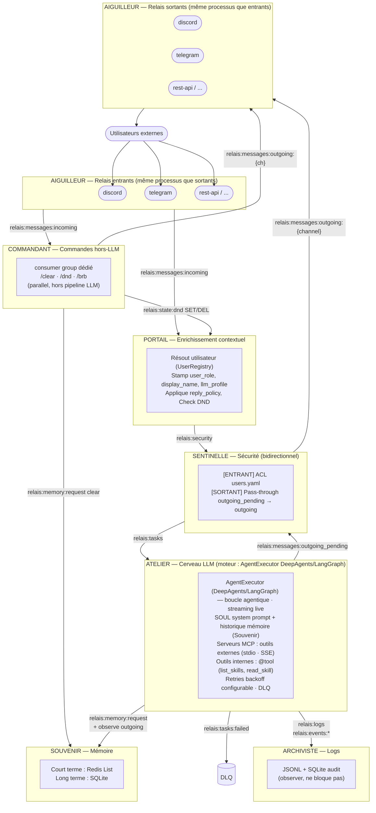

# RELAIS

RELAIS est une architecture micro-brique pour un assistant IA autonome et modulaire. Chaque brique gère une responsabilité spécifique et communique via Redis Streams, permettant un système flexible, résilient et facilement extensible.

---

## Architecture

### Diagramme ASCII

```
[Utilisateurs externes]
        │
        ▼
┌───────────────────────────────────────────────────────────────┐
│ AIGUILLEUR — Relais entrants                                  │
│  ┌────────────┐   ┌────────────┐   ┌────────────┐            │
│  │  discord   │   │  telegram  │   │  rest-api  │   ...      │
│  └─────┬──────┘   └─────┬──────┘   └─────┬──────┘            │
└────────┼────────────────┼────────────────┼────────────────────┘
         └────────────────┴────────────────┘
                          │ relais:messages:incoming
              ┌───────────┴────────────┐
              ▼                        ▼
┌─────────────────────────┐  ┌─────────────────────────────────────────────┐
│ COMMANDANT              │  │ PORTAIL — Enrichissement contextuel         │
│  Commandes hors-LLM     │  │  Consomme : relais:messages:incoming        │
│  /clear /dnd /brb       │  │  Résout utilisateur (UserRegistry)          │
│  (consumer group dédié) │  │  Stamp métadonnées : user_role, llm_profile │
└─────────────────────────┘  │  Applique reply_policy, Check DND            │
                             │  Produit  : relais:security                 │
                             └─────────────────────────────────────────────┘
                          │
                    relais:security
                          │
                          ▼
┌─────────────────────────────────────────────────────────────┐
│ SENTINELLE — Sécurité (point de contrôle bidirectionnel)    │
│  [ENTRANT] Consomme : relais:security                       │
│  Vérifie les ACL (users.yaml)                               │
│  [ENTRANT] Produit  : relais:tasks                          │
└─────────────────────────────────────────────────────────────┘
                          │
                     relais:tasks
                          │
                          ▼
┌─────────────────────────────────────────────────────────────────┐
│ ATELIER — Cerveau LLM  (moteur : AgentExecutor DeepAgents/LangGraph) │
│  Consomme : relais:tasks                                        │
│  · Personnalité SOUL + historique Souvenir → system prompt      │
│  · AgentExecutor (DeepAgents/LangGraph) — boucle agentique, streaming live │
│  · Appel direct au provider LLM (ANTHROPIC_API_KEY)             │
│  · Serveurs MCP : outils externes (stdio · SSE · HTTP)          │
│  · Outils internes (@tool) : list_skills, read_skill            │
│  · Retries avec backoff configurable                            │
│  Produit  : relais:messages:outgoing_pending           (réponse)│
│             relais:streaming:{channel}:{cid}    (chunks live)   │
│             relais:tasks:failed                 (DLQ)           │
└─────────────────────────────────────────────────────────────────┘
          │                        │                   │
relais:messages:outgoing_pending       │       relais:logs /
          │                   relais:memory:*   relais:events:*
          ▼                        │                   ▼
┌─────────────────────────────────────────────────────────────┐
│ SENTINELLE — flux sortant (guardrails + routage)            │
│  [SORTANT] Consomme : relais:messages:outgoing_pending       │
│  [SORTANT] Produit  : relais:messages:outgoing:{ch}         │
└─────────────────────────────────────────────────────────────┘
          │                        ▼
   relais:messages:outgoing:{ch}   ▼
          ▼                  ┌──────────────┐   ┌──────────────┐
┌───────────────────────┐    │   SOUVENIR   │   │  ARCHIVISTE  │
│ AIGUILLEUR            │    │  Mémoire     │   │  Logs        │
│  Relais sortants      │    │  court/long  │   │  JSONL +     │
│  ┌──────┐ ┌────────┐  │    │  terme       │   │  SQLite      │
│  │disco.│ │telegr. │  │    └──────────────┘   └──────────────┘
│  └──────┘ └────────┘  │
└──────────┬────────────┘
           │
           ▼
  [Utilisateurs externes]
```

> **Note :** les relais entrants et sortants sont le **même processus** par canal —
> `aiguilleur/discord/main.py` gère à la fois la réception (→ Redis) et l'envoi (Redis →).

---

### Diagramme Mermaid



---

## ATELIER — Moteur LLM

L'Atelier est la brique qui exécute l'intelligence. Il utilise **DeepAgents/LangGraph** (`AgentExecutor`) avec une boucle agentique multi-tours, en appelant directement le provider LLM (Anthropic, OpenRouter, Ollama, LM Studio…) via LangChain `init_chat_model`.

### Capacités actives

| Capacité | Implémentation |
|----------|---------------|
| **Personnalité SOUL** | System prompt multi-couche : `SOUL.md` + variantes canal/contexte, assemblé par `soul_assembler` |
| **Mémoire conversationnelle** | Historique court-terme injecté depuis Souvenir avant chaque appel |
| **Serveurs MCP** | Outils externes via stdio ou SSE — déclarés dans `mcp_servers.yaml`, filtrés par profil |
| **Outils internes** | Fonctions `@tool` LangChain exposées à la boucle agentique (`list_skills`, `read_skill`) |
| **Streaming live** | Chunks publiés en temps réel sur `relais:messages:streaming:{channel}:{cid}` → rendu progressif (Telegram, TUI — désactivé sur Discord) |
| **Profils LLM** | Modèle, température, max_turns, base_url, api_key_env configurables par profil (`profiles.yaml`) |
| **Multi-provider** | Anthropic, OpenRouter, Ollama, LM Studio — endpoint et clé API par profil |
| **Résilience** | Retry avec backoff configurable ; messages non-récupérables → DLQ (`relais:tasks:failed`) |

### Flux d'exécution simplifié

```
relais:tasks
    │
    ▼
[1] Résoudre le profil LLM  (profiles.yaml → modèle, max_turns, …)
[2] Récupérer le contexte   (relais:memory:request → Souvenir → historique)
[3] Assembler le system prompt  (SOUL.md + variante canal)
[4] Charger les MCP servers  (mcp_servers.yaml, filtre profil)
[5] AgentExecutor.execute() → agent.astream() → buffer chunks (~80 chars)
[6] Publier les chunks  → relais:messages:streaming:{channel}:{cid}
    │  tool_use → exécuté par DeepAgents/LangGraph automatiquement
    │  end_turn → sortie de boucle
    │  AgentExecutionError (4xx/5xx) → DLQ
[7] Publier la réponse  → relais:messages:outgoing:{channel}
```

---

## Installation

### Prérequis

- Python ≥ 3.11
- Redis ≥ 5.0 — installer de préférence via Homebrew :
  ```bash
  brew install redis
  ```
- [`uv`](https://docs.astral.sh/uv/) (recommandé) ou `pip`
- `supervisord` (optionnel, pour l'orchestration multi-processus)

### Étapes

```bash
# 1. Cloner le projet
git clone <repo-url>
cd relais

# 2. Installer les dépendances
uv sync
# ou : pip install -e .

# 3. Initialiser le répertoire utilisateur (~/.relais/)
#    Crée la structure et copie tous les fichiers de configuration par défaut
python -c "from common.init import initialize_user_dir; from pathlib import Path; initialize_user_dir(Path('.'))"

# 4. Appliquer les migrations SQLite (Souvenir)
alembic upgrade head

# 5. Configurer l'environnement
cp .env.example .env
# Éditez .env avec vos clés API
```

---

## Configuration

Tous les fichiers de configuration se trouvent dans `~/.relais/config/` après l'initialisation. Ne modifiez jamais les fichiers sous `./config/` directement — ils servent de modèles.

### Résolution de configuration (cascade)

`~/.relais/config/` → `/opt/relais/config/` → `./config/`

Le premier fichier trouvé est utilisé. `RELAIS_HOME` surcharge `~/.relais` (utile pour Docker ou multi-instance).

### Structure du répertoire utilisateur

```
~/.relais/
├── config/
│   ├── config.yaml          Configuration système principale
│   ├── litellm.yaml         Modèles LLM et proxy
│   ├── profiles.yaml        Profils LLM (température, tokens, résilience)
│   ├── users.yaml           Registre des utilisateurs et ACL
│   ├── reply_policy.yaml    Politique de réponse automatique
│   ├── channels.yaml        Canaux actifs, streaming, redémarrages (Aiguilleur + Atelier)
│   ├── mcp_servers.yaml     Serveurs MCP (outils externes)
│   └── HEARTBEAT.md         Tâches CRON planifiées
├── prompts/                 System prompt multi-couche (voir section dédiée ci-dessous)
│   ├── soul/
│   │   ├── SOUL.md          Personnalité principale de l'assistant  ← Layer 1
│   │   └── variants/        Variantes de personnalité (usage manuel)
│   ├── roles/               Overlays par rôle utilisateur           ← Layer 2
│   ├── users/               Overrides par utilisateur               ← Layer 3
│   ├── channels/            Formatage par canal                     ← Layer 4
│   └── policies/            Overlays de politique de réponse        ← Layer 5
├── storage/
│   ├── memory.db            Mémoire long-terme (SQLite, géré par Alembic)
│   └── audit.db             Journal d'audit
├── logs/
└── redis.sock               Socket Unix Redis
```

---

### `config.yaml` — Configuration système

```yaml
redis:
  unix_socket: ~/.relais/redis.sock   # Socket Unix Redis
  password: "${REDIS_PASSWORD}"

litellm:
  base_url: "http://127.0.0.1:4000"  # URL du proxy LiteLLM
  api_key: "${LITELLM_MASTER_KEY}"

logging:
  level: INFO          # DEBUG | INFO | WARNING | ERROR
  format: text         # "text" (dev) | "json" (production)
  rotation: daily
  retention_days: 30

llm:
  default_profile: default   # Profil utilisé si l'utilisateur n'en a pas de spécifique

security:
  session_ttl: 86400        # Durée de vie session (secondes)
  max_message_size: 8192    # Taille max message entrant (octets)

paths:
  backup: ~/.relais/backup
  media:  ~/.relais/media
  skills: ~/.relais/skills
  logs:   ~/.relais/logs
```

---

### `litellm.yaml` — Proxy LLM

LiteLLM est un proxy transparent entre les briques et les fournisseurs LLM. Atelier envoie toutes ses requêtes à `ANTHROPIC_BASE_URL` et LiteLLM les route vers le bon backend.

**Lien critique :** le champ `model` dans `profiles.yaml` doit correspondre exactement à un `model_name` ici.

```yaml
model_list:

  # Modèle local (LM Studio, Ollama, vLLM...)
  - model_name: mon-modele-local        # ← doit matcher profiles.yaml:model
    litellm_params:
      model: openai/mon-modele-local    # ⚠️ OBLIGATOIRE : préfixe "openai/" requis pour tout
                                        # endpoint compatible OpenAI (LM Studio, Ollama, vLLM).
                                        # Sans ce préfixe, LiteLLM ne peut pas identifier le
                                        # provider et rejette le déploiement au démarrage.
      api_base: http://192.168.1.x:1234/v1
      api_key: lm-studio                # Clé factice requise mais ignorée en local

  # Modèle cloud via OpenRouter
  - model_name: mistral-small-2603
    litellm_params:
      model: openrouter/mistralai/mistral-small-3.1-24b-instruct
      api_key: os.environ/OPENROUTER_API_KEY

  # Modèle Anthropic direct
  - model_name: claude-sonnet-4-5
    litellm_params:
      model: anthropic/claude-sonnet-4-5
      api_key: os.environ/ANTHROPIC_API_KEY

general_settings:
  master_key: sk-changeme        # = LITELLM_MASTER_KEY dans .env
                                 # ⚠️  Cette valeur DOIT être identique à ANTHROPIC_API_KEY dans .env
                                 # et dans supervisord.conf (ANTHROPIC_API_KEY de la brique atelier).
                                 # Le CLI claude envoie ANTHROPIC_API_KEY comme clé d'authentification
                                 # au proxy LiteLLM. Si les deux ne correspondent pas → 400 Bad Request.
  store_model_usage: false
  disable_on_error_types:
    - "RateLimitError"

router_settings:
  routing_strategy: latency-based-routing   # latency-based-routing | simple-shuffle | least-busy
  enable_pre_call_checks: true
```

Pour lancer le proxy manuellement :
```bash
uv run --with "litellm[proxy]" litellm --config ~/.relais/config/litellm.yaml --port 4000
```

---

### `profiles.yaml` — Profils LLM

Chaque profil définit le comportement LLM pour une catégorie d'usage. Le profil actif est résolu dans cet ordre de priorité : **`profile` dans `channels.yaml`** (canal gagne toujours) → `llm.default_profile` dans `config.yaml` (fallback système). Le champ `llm_profile` dans `users.yaml` n'est plus utilisé pour la résolution du modèle.

Le champ `model` utilise le format `provider:model-id` (ex. `anthropic:claude-haiku-4-5`). Les champs `base_url` et `api_key_env` sont **obligatoires** dans chaque profil — déclarez-les explicitement même si leur valeur est `null`.

`base_url` accepte une URL littérale **ou** une référence à une variable d'environnement via la syntaxe `${VAR}`. Si la variable n'est pas définie au démarrage, le chargement échoue immédiatement (fail-fast).

```yaml
profiles:
  mon-profil:
    model: anthropic:claude-haiku-4-5   # Format obligatoire : provider:model-id
    temperature: 0.7            # 0.0 (déterministe) → 1.0 (créatif)
    max_tokens: 1024
    base_url: null              # null = endpoint par défaut du provider
                                # URL littérale : http://192.168.1.134:1234/v1
                                # Variable d'env : "${LM_STUDIO_URL}"  ← interpolée au démarrage
    api_key_env: ANTHROPIC_API_KEY  # Nom de la variable d'env contenant la clé API
                                    # null = aucune clé injectée (ex. Ollama local)

    resilience:
      retry_attempts: 3
      retry_delays: [2, 5, 15]  # Délais en secondes entre tentatives
      fallback_model: null      # Modèle de repli si tous les retries échouent

    max_turns: 10
    mcp_timeout: 10             # Timeout (s) par appel outil MCP
    mcp_max_tools: 20           # Max outils MCP exposés au modèle (0 = aucun)
    allowed_tools: null         # null = tous les outils autorisés
    allowed_mcp: null           # null = tous les serveurs MCP autorisés
    guardrails: []
    memory_scope: own           # "own" = mémoire par utilisateur | "global" = partagée
```

**Exemples de configuration par provider :**

| Provider | `model` | `base_url` | `api_key_env` |
|----------|---------|-----------|--------------|
| Anthropic (cloud) | `anthropic:claude-haiku-4-5` | `null` | `ANTHROPIC_API_KEY` |
| OpenRouter | `openrouter:openai/gpt-4o-mini` | `null` | `OPENROUTER_API_KEY` |
| Ollama (local) | `ollama:llama3` | `null` | `null` |
| LM Studio (IP fixe) | `openai:my-model` | `http://192.168.1.x:1234/v1` | `null` |
| LM Studio (variable) | `openai:my-model` | `"${LM_STUDIO_URL}"` | `null` |

> `export LM_STUDIO_URL=http://192.168.1.134:1234/v1` — si la variable n'est pas définie, le démarrage échoue avec une `ValueError` explicite.

**Profils livrés par défaut :**

| Profil | Usage |
|--------|-------|
| `default` | Équilibre vitesse/qualité |
| `fast` | Réponses courtes, latence minimale |
| `precise` | Raisonnement approfondi, réponses longues |
| `coder` | Génération et révision de code |
| `memory_extractor` | Usage interne (Souvenir) — ne pas modifier |

---

### `users.yaml` — Registre des utilisateurs (ACL)

Chargé par la Sentinelle. Détermine si un utilisateur est autorisé et quel profil LLM lui est assigné.
L'identité est contextuelle : `(canal, contexte, id_brut)` — ex. Discord distingue `dm` et `server`.

```yaml
access_control:
  default_mode: allowlist       # "allowlist" (défaut) | "blocklist"
  channels:                     # Surcharges optionnelles par canal
    # telegram:
    #   mode: blocklist

groups: []                      # Groupes WhatsApp / Telegram — autorisation par group_id
# Exemple :
# groups:
#   - channel: whatsapp
#     group_id: "120363000000000@g.us"
#     allowed: true
#     blocked: false
#     llm_profile: fast

users:
  usr_mon_utilisateur:
    display_name: "Prénom Nom"
    role: user                            # "admin" | "user"
    blocked: false
    llm_profile: default
    identifiers:
      discord:
        dm: "123456789012345678"          # ID Discord (entier, pas le username)
        server: null                      # null = refus des mentions en serveur
      telegram:
        dm: "987654321"                   # chat_id Telegram
    notes: "Commentaire libre"

roles:
  admin:
    actions: ["send", "command", "admin"]
  user:
    actions: ["send"]
```

**Modes ACL :**
- `allowlist` : seuls les utilisateurs/groupes déclarés sont admis. Politique pour les inconnus : `deny` (rejet), `guest` (profil limité) ou `pending` (notif admin).
- `blocklist` : tous admis sauf les utilisateurs/groupes marqués `blocked: true`.

**Rôles :**
- `admin` : toutes les actions (`send`, `command`, `admin`)
- `user` : `send` uniquement

> `usr_system` est un compte interne utilisé par les briques — ne pas supprimer.

---

### `reply_policy.yaml` — Politique de réponse automatique

Chargé par le Portail. Détermine si un message entrant doit être traité ou ignoré.

```yaml
reply_policy:
  enabled: true

  channels:
    - discord
    # - telegram
    # - whatsapp

  blocked_users: []             # user_id refusés sans réponse

  debounce_seconds: 2           # Anti-flood : délai min entre deux réponses au même utilisateur

  out_of_hours:
    enabled: false
    active_start: "08:00"       # Plage active (HH:MM)
    active_end: "22:00"
    timezone: "Europe/Paris"    # Fuseau tz database
    prompt_file: "prompts/out_of_hours.md"

  ignored_prefixes:
    - "!"                       # Commandes bots tiers
    - "/"                       # Slash commands

  min_message_length: 2
```

---

### `channels.yaml` — Configuration des canaux AIGUILLEUR

Centralise l'activation/désactivation de tous les canaux et configure le comportement de chaque adaptateur.

```yaml
channels:
  discord:
    enabled: true                    # Activé/désactivé
    streaming: false                 # Streaming désactivé sur Discord (réponse complète en un message)
    type: native                     # "native" (Python) | "external" (subprocess)
    class_path: null                 # Override optionnel : "aiguilleur.channels.discord.adapter.DiscordAiguilleur"
    max_restarts: 5                  # Nombre max de redémarrages avant abandon
    # profile non défini → utilise config.yaml > llm.default_profile

  telegram:
    enabled: false
    streaming: true
    type: native
    class_path: null
    max_restarts: 5
    profile: fast                    # Profil LLM imposé à tous les messages de ce canal

  slack:
    enabled: false
    streaming: false
    type: native
    class_path: null
    max_restarts: 5

  rest:
    enabled: false
    streaming: false
    type: native
    class_path: null
    max_restarts: 5

  tui:
    enabled: false
    streaming: true
    type: native
    class_path: null
    max_restarts: 5

  # Exemple : canal externe (non-Python)
  whatsapp:
    enabled: false
    streaming: false
    type: external
    command: "node"
    args: ["aiguilleur/whatsapp/index.js"]
    max_restarts: 3
```

**Paramètres :**
- `enabled` — active/désactive le canal sans redémarrage du processus AIGUILLEUR
- `streaming` — indique si le canal supporte le streaming progressif ; lu par **Atelier au démarrage** — un changement de cette valeur nécessite `supervisorctl restart atelier` (et `restart aiguilleur`)
- `type` — `native` (adaptateur Python thread+asyncio) ou `external` (subprocess)
- `class_path` — override optionnel du chemin de la classe adaptateur
- `max_restarts` — limite de redémarrages automatiques (exponential backoff `min(2^count, 30)` secondes)
- `command`/`args` — requis pour `type: external` uniquement
- `profile` — profil LLM appliqué à tous les messages du canal (optionnel) ; stampé dans `envelope.metadata["llm_profile"]` par l'Aiguilleur ; si absent, utilise `config.yaml > llm.default_profile`

**Activation/désactivation sans redémarrage :**
Modifier `enabled: true/false` dans `~/.relais/config/channels.yaml` et redémarrer AIGUILLEUR via supervisord (`supervisorctl restart aiguilleur`). Le changement ne demande pas la reconfiguration du reste du système.

---

### `mcp_servers.yaml` — Serveurs MCP

Serveurs [Model Context Protocol](https://modelcontextprotocol.io) chargés par l'Atelier pour enrichir le contexte LLM avec des outils externes.

```yaml
mcp_servers:

  # Serveurs globaux — disponibles pour tous les profils
  global:
    - name: calendar
      type: sse               # "sse" | "stdio"
      url: "http://127.0.0.1:8100"
      enabled: true
    - name: filesystem
      type: stdio
      command: npx
      args: ["-y", "@modelcontextprotocol/server-filesystem", "/tmp"]
      enabled: false

  # Serveurs contextuels — activés uniquement pour certains profils
  contextual:
    - name: brave-search
      type: sse
      url: "http://127.0.0.1:8101"
      enabled: false
      profiles: [precise, coder]
```

**Transports :**
- `stdio` : processus local via stdin/stdout — l'Atelier spawne le serveur comme sous-processus (recommandé pour outils CLI)
- `sse` : Server-Sent Events — connexion à un serveur HTTP existant (recommandé pour services distants persistants)

> **Timeout et nombre max d'outils** — configurés par profil dans `profiles.yaml` (champs `mcp_timeout` et `mcp_max_tools`).

---

### Personnalisation du system prompt

L'Atelier assemble le system prompt à partir de **5 couches optionnelles** lues dans `~/.relais/prompts/`. Les fichiers manquants sont ignorés silencieusement — il suffit de créer ceux dont vous avez besoin.

| Couche | Répertoire | Convention de nom | Déclencheur |
|--------|-----------|-------------------|-------------|
| 1 — Personnalité | `prompts/soul/` | `SOUL.md` (fixe) | Toujours chargé (warning si absent) |
| 2 — Rôle | `prompts/roles/` | `{role}.md` | Quand l'utilisateur a un `role` dans `users.yaml` |
| 3 — Utilisateur | `prompts/users/` | `{channel}_{id}.md` | Quand `sender_id` est défini (`:` → `_`) |
| 4 — Canal | `prompts/channels/` | `{channel}_default.md` | Quand un canal est actif |
| 5 — Politique | `prompts/policies/` | `{policy}.md` | Quand `reply_policy` est actif |

Les couches présentes sont concaténées dans l'ordre avec `---` comme séparateur. Une **6e couche** (faits mémoire long-terme sur l'utilisateur) est ajoutée dynamiquement par le Souvenir — elle ne correspond à aucun fichier sur disque.

**Exemples de fichiers à créer :**

```
# Personnalité — toujours active
~/.relais/prompts/soul/SOUL.md

# Overlay pour le rôle "admin" (users.yaml : role: admin)
~/.relais/prompts/roles/admin.md

# Override spécifique à un utilisateur Discord (sender_id "discord:123456789")
~/.relais/prompts/users/discord_123456789.md

# Formatage Telegram (canal "telegram")
~/.relais/prompts/channels/telegram_default.md

# Overlay activé quand reply_policy = "in_meeting"
~/.relais/prompts/policies/in_meeting.md
```

> **Variantes de personnalité** : `prompts/soul/variants/` contient des variantes livrées (`SOUL_concise.md`, `SOUL_professional.md`) que vous pouvez copier sur `prompts/soul/SOUL.md` pour changer la personnalité de base.

---

### `HEARTBEAT.md` — Tâches planifiées (CRON)

Chargé par le Veilleur. Définit les tâches automatiques récurrentes.

```yaml
tasks:
  - cron: "0 8 * * *"          # Expression CRON standard Unix (5 champs)
    task: daily_summary
    params:
      channel: discord
      llm_profile: default
      prompt: "Génère un résumé des activités de la journée passée."
    enabled: true

  - cron: "0 3 * * 1"
    task: backup
    params:
      destination: ~/.relais/backup/
      retention_days: 30
    enabled: true

  - cron: "0 2 * * 0"
    task: cleanup_logs
    params:
      max_age_days: 30
    enabled: true
```

**Types de tâches :**

| `task` | Description | Params requis |
|--------|-------------|---------------|
| `daily_summary` | Génère et envoie un résumé LLM | `channel`, `llm_profile`, `prompt` |
| `backup` | Sauvegarde `~/.relais/storage/` | `destination`, `retention_days` |
| `cleanup_logs` | Supprime les logs anciens | `max_age_days` |

Pour désactiver sans supprimer : `enabled: false`.

---

## Variables d'environnement (.env)

| Variable | Description | Exemple |
|----------|-------------|---------|
| `ANTHROPIC_API_KEY` | Clé API directe vers Anthropic (utilisée par DeepAgents/LangChain) | `sk-ant-xxx` |
| `REDIS_SOCKET_PATH` | Path socket Unix Redis | `~/.relais/redis.sock` |
| `REDIS_PASSWORD` | Mot de passe Redis admin — doit correspondre à `requirepass` dans `config/redis.conf` | |
| `REDIS_PASS_PORTAIL` | Mot de passe brique Portail | |
| `REDIS_PASS_SENTINELLE` | Mot de passe brique Sentinelle | |
| `REDIS_PASS_ATELIER` | Mot de passe brique Atelier | |
| `REDIS_PASS_SOUVENIR` | Mot de passe brique Souvenir | |
| `DISCORD_BOT_TOKEN` | Token Discord bot | |
| `TELEGRAM_BOT_TOKEN` | Token Telegram bot | |
| `OPENROUTER_API_KEY` | Clé OpenRouter | |
| `RELAIS_HOME` | Chemin alternatif à `~/.relais` | Optionnel |

---

## Lancement

### Option A : supervisord (recommandé)

```bash
supervisord -c supervisord.conf

# Vérifier l'état
supervisorctl status

# Suivre les logs d'une brique
supervisorctl tail atelier -f

# Redémarrer une brique
supervisorctl restart atelier
```

Wrapper local :

```bash
./supervisor.sh start all
./supervisor.sh status
./supervisor.sh restart all
./supervisor.sh stop all
```

### Option B : manuellement (développement)

```bash
# Terminal 1 — Redis
redis-server config/redis.conf

# Terminal 2+ — Briques (dans l'ordre)
uv run python portail/main.py
uv run python sentinelle/main.py
uv run python atelier/main.py
uv run python souvenir/main.py
uv run python aiguilleur/discord/main.py
uv run python archiviste/main.py
```

### Vérifier le pipeline

```bash
# Inspecter les streams Redis
redis-cli -s ~/.relais/redis.sock XLEN relais:messages:incoming
redis-cli -s ~/.relais/redis.sock XLEN relais:security
redis-cli -s ~/.relais/redis.sock XLEN relais:tasks

# Messages en attente (PEL) par brique
redis-cli -s ~/.relais/redis.sock XPENDING relais:messages:incoming portail_group
redis-cli -s ~/.relais/redis.sock XPENDING relais:security sentinelle_group
redis-cli -s ~/.relais/redis.sock XPENDING relais:tasks atelier_group

# Voir le contenu d'un stream
redis-cli -s ~/.relais/redis.sock XRANGE relais:tasks - +

# Suivre les logs JSON
tail -f ~/.relais/logs/events.jsonl
```

---

## Débogage avec debugpy

Toutes les briques sont lancées via `launcher.py`, un wrapper qui active **debugpy** à la demande via des variables d'environnement. Aucune modification de code n'est nécessaire.

### Ports attribués par brique

| Brique       | Port  |
|--------------|-------|
| `atelier`    | 5678  |
| `portail`    | 5679  |
| `sentinelle` | 5680  |
| `archiviste` | 5681  |
| `souvenir`   | 5682  |
| `commandant` | 5683  |
| `aiguilleur` | 5684  |

### Variables de contrôle

| Variable         | Valeur | Effet |
|------------------|--------|-------|
| `DEBUGPY_ENABLED` | `"1"` | Active debugpy (écoute sur `DEBUGPY_PORT`) |
| `DEBUGPY_ENABLED` | `"0"` | Désactivé — la brique démarre normalement (défaut) |
| `DEBUGPY_WAIT`   | `"1"` | **Bloque le démarrage** jusqu'à ce qu'un débogueur s'attache |
| `DEBUGPY_WAIT`   | `"0"` | La brique démarre immédiatement, le débogueur peut s'attacher après (défaut) |
| `DEBUGPY_PORT`   | entier | Port d'écoute (déjà configuré par brique dans `supervisord.conf`) |

### Activer le débogage via supervisord

Modifiez la ligne `environment=` de la brique cible dans `supervisord.conf`, puis redémarrez-la :

```ini
; Exemple : débugger atelier avec attente du débogueur
[program:atelier]
environment=...,DEBUGPY_ENABLED="1",DEBUGPY_PORT="5678",DEBUGPY_WAIT="1"
```

```bash
supervisorctl restart atelier
# → La brique attend l'attachement VS Code avant de démarrer
```

> Remettez `DEBUGPY_ENABLED="0"` et `DEBUGPY_WAIT="0"` une fois le débogage terminé, puis relancez la brique.

### Activer le débogage manuellement (sans supervisord)

```bash
# Débogage immédiat (pas d'attente)
DEBUGPY_ENABLED=1 DEBUGPY_PORT=5679 uv run python launcher.py portail/main.py

# Débogage avec attente du débogueur (bloque au démarrage)
DEBUGPY_ENABLED=1 DEBUGPY_PORT=5679 DEBUGPY_WAIT=1 uv run python launcher.py portail/main.py
```

### Connexion depuis VS Code

Ajoutez une configuration dans `.vscode/launch.json` :

```json
{
  "version": "0.2.0",
  "configurations": [
    {
      "name": "Attach — atelier (5678)",
      "type": "debugpy",
      "request": "attach",
      "connect": { "host": "localhost", "port": 5678 },
      "pathMappings": [{ "localRoot": "${workspaceFolder}", "remoteRoot": "." }]
    },
    {
      "name": "Attach — portail (5679)",
      "type": "debugpy",
      "request": "attach",
      "connect": { "host": "localhost", "port": 5679 },
      "pathMappings": [{ "localRoot": "${workspaceFolder}", "remoteRoot": "." }]
    },
    {
      "name": "Attach — sentinelle (5680)",
      "type": "debugpy",
      "request": "attach",
      "connect": { "host": "localhost", "port": 5680 },
      "pathMappings": [{ "localRoot": "${workspaceFolder}", "remoteRoot": "." }]
    },
    {
      "name": "Attach — archiviste (5681)",
      "type": "debugpy",
      "request": "attach",
      "connect": { "host": "localhost", "port": 5681 },
      "pathMappings": [{ "localRoot": "${workspaceFolder}", "remoteRoot": "." }]
    },
    {
      "name": "Attach — souvenir (5682)",
      "type": "debugpy",
      "request": "attach",
      "connect": { "host": "localhost", "port": 5682 },
      "pathMappings": [{ "localRoot": "${workspaceFolder}", "remoteRoot": "." }]
    },
    {
      "name": "Attach — commandant (5683)",
      "type": "debugpy",
      "request": "attach",
      "connect": { "host": "localhost", "port": 5683 },
      "pathMappings": [{ "localRoot": "${workspaceFolder}", "remoteRoot": "." }]
    },
    {
      "name": "Attach — aiguilleur (5684)",
      "type": "debugpy",
      "request": "attach",
      "connect": { "host": "localhost", "port": 5684 },
      "pathMappings": [{ "localRoot": "${workspaceFolder}", "remoteRoot": "." }]
    }
  ]
}
```

Lancez la brique avec `DEBUGPY_ENABLED=1`, puis dans VS Code : **Run → Start Debugging** (ou `F5`) sur la configuration correspondante.

---

## Tests

```bash
# Lancer tous les tests
pytest tests/ -v

# Avec couverture
pytest tests/ -v --cov=common,portail,sentinelle,atelier,souvenir,aiguilleur,archiviste --cov-report=term-missing
```

---

## Documentation

- **[docs/ARCHITECTURE.md](docs/ARCHITECTURE.md)** — Architecture technique, flux de données, dependency map
- **[docs/CONTRIBUTING.md](docs/CONTRIBUTING.md)** — Setup dev, patterns de test, checklist nouvelle brique
- **[plans/RELAIS_ARCHITECTURE_COMPLETE_v12.md](plans/RELAIS_ARCHITECTURE_COMPLETE_v12.md)** — Expression fonctionnelle complète du projet
