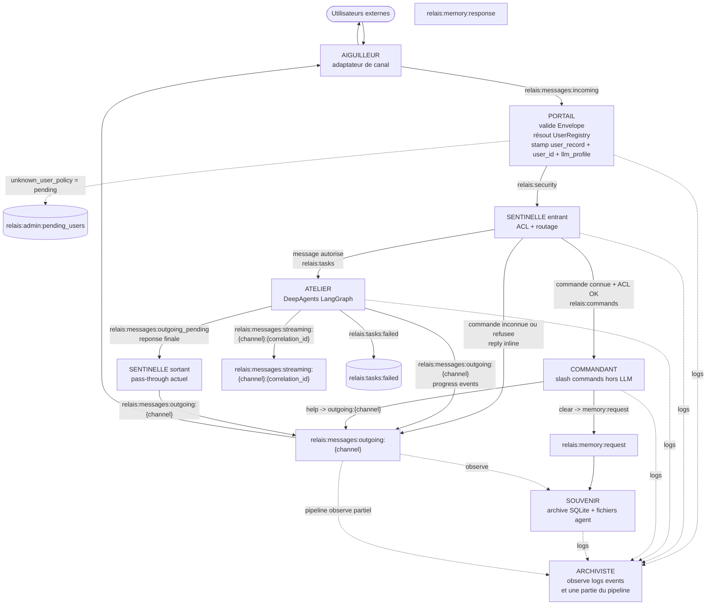

# RELAIS

RELAIS est une architecture micro-briques pour assistant IA, orchestrée via Redis Streams. Ce README décrit l'état réellement implémenté dans le code du dépôt aujourd'hui.

---

## Vue d'ensemble

Les briques actives du repo sont :

- `aiguilleur` : adaptateurs de canaux entrants/sortants
- `portail` : validation d'enveloppe + résolution d'identité
- `sentinelle` : ACL et routage messages/commandes
- `atelier` : exécution LLM via DeepAgents/LangGraph
- `commandant` : commandes slash hors LLM
- `souvenir` : mémoire court terme Redis + archivage SQLite
- `archiviste` : logs et observation partielle du pipeline

L'implémentation locale inclut surtout un adaptateur Discord complet. La configuration de canaux prévoit aussi `telegram`, `slack`, `rest` et `tui`, mais leur présence dans les fichiers de config ne signifie pas qu'un adaptateur complet existe forcément dans ce dépôt.

---

## Architecture

### Flux réel



### Streams Redis importants

| Stream | Producteur | Consommateur |
|--------|------------|--------------|
| `relais:messages:incoming` | Aiguilleur | Portail |
| `relais:security` | Portail | Sentinelle |
| `relais:tasks` | Sentinelle | Atelier |
| `relais:commands` | Sentinelle | Commandant |
| `relais:memory:request` | Commandant | Souvenir |
| `relais:messages:outgoing_pending` | Atelier | Sentinelle |
| `relais:messages:outgoing:{channel}` | Sentinelle, Atelier, Commandant, Souvenir | Aiguilleur, Souvenir |
| `relais:messages:streaming:{channel}:{correlation_id}` | Atelier | adaptateur de canal streaming |
| `relais:tasks:failed` | Atelier | observateurs / diagnostics |
| `relais:admin:pending_users` | Portail | revue manuelle |
| `relais:logs` | toutes les briques | Archiviste |

### Comportement des briques

- `Portail` consomme `relais:messages:incoming`, résout l'utilisateur via `UserRegistry`, écrit `metadata["user_record"]`, `metadata["user_id"]` et `metadata["llm_profile"]` (depuis `channel_profile` ou `"default"`), puis publie sur `relais:security`.
- `Sentinelle` consomme `relais:security`, applique les ACL, route les messages normaux vers `relais:tasks` et les slash commands vers `relais:commands`. Les commandes inconnues ou non autorisées génèrent une réponse inline directe sur `relais:messages:outgoing:{channel}`.
- `Commandant` consomme `relais:commands`. `/help` répond directement sur `relais:messages:outgoing:{channel}`. `/clear` publie une requête `clear` sur `relais:memory:request`.
- `Atelier` consomme `relais:tasks`, gère l'historique conversationnel via le checkpointer LangGraph persistant (`AsyncSqliteSaver`, `checkpoints.db`, keyed by `user_id`), publie éventuellement le streaming sur `relais:messages:streaming:{channel}:{correlation_id}`, les événements de progression sur `relais:messages:outgoing:{channel}`, puis la réponse finale sur `relais:messages:outgoing_pending`. Atelier supporte des sous-agents auto-découverts dans `atelier/agents/` ; l'accès par rôle est contrôlé via `allowed_subagents` dans `portail.yaml`.
- `Souvenir` consomme `relais:memory:request` (actions : `clear`, `file_write`, `file_read`, `file_list`) et observe les streams `relais:messages:outgoing:{channel}` pour archiver chaque tour dans SQLite (`messages_raw`). L'historique court terme est géré par le checkpointer LangGraph d'Atelier.
- `Archiviste` observe `relais:logs`, `relais:events:*` et une liste partielle de streams pipeline. Il n'observe pas littéralement tous les streams.

---

## Installation

### Prérequis

- Python `>=3.11`
- `uv`
- `supervisord` si vous voulez utiliser le lancement supervisé
- Redis local si vous démarrez le système complet

### Chemin recommandé

```bash
git clone <repo-url>
cd relais

uv sync

cp .env.example .env

python -c "from common.init import initialize_user_dir; initialize_user_dir()"

alembic upgrade head
```

### Ce que fait l'initialisation

`initialize_user_dir()` crée `RELAIS_HOME` et y copie seulement certains templates. En particulier :

- copiés : `config/config.yaml`, `config/portail.yaml`, `config/sentinelle.yaml`, `config/atelier.yaml`, `config/atelier/profiles.yaml`, `config/atelier/mcp_servers.yaml`, `config/HEARTBEAT.md`, les prompts livrés
- non copié aujourd'hui : `config/channels.yaml`

Si vous voulez surcharger `channels.yaml`, créez-le vous-même dans `RELAIS_HOME/config/channels.yaml` à partir de [config/channels.yaml.default](/Users/benjaminmarchand/IdeaProjects/relais/config/channels.yaml.default).

### `RELAIS_HOME`

Par défaut, `RELAIS_HOME` vaut `./.relais` à la racine du dépôt. Vous pouvez le surcharger avec la variable d'environnement `RELAIS_HOME`.

La cascade de résolution est :

1. `RELAIS_HOME`
2. `/opt/relais`
3. `./`

Cette cascade est utilisée pour la configuration et les prompts. Les répertoires `skills`, `logs`, `media` et `storage` restent centrés sur `RELAIS_HOME`.

---

## Arborescence de travail

Après initialisation, l'arborescence utilisateur ressemble à ceci :

```text
<RELAIS_HOME>/
├── config/
│   ├── config.yaml
│   ├── portail.yaml
│   ├── sentinelle.yaml
│   ├── atelier.yaml
│   ├── HEARTBEAT.md
│   └── atelier/
│       ├── profiles.yaml
│       └── mcp_servers.yaml
├── prompts/
│   ├── soul/
│   │   ├── SOUL.md
│   │   └── variants/
│   ├── channels/
│   ├── policies/
│   ├── roles/
│   └── users/
├── skills/
├── media/
├── logs/
├── backup/
└── storage/
    └── memory.db
```

`audit.db` n'est pas une base actuellement gérée par le code. L'Archiviste écrit surtout dans `logs/events.jsonl` et dans les logs de processus.

---

## Configuration

### `config/config.yaml`

Le runtime lit aujourd'hui surtout `llm.default_profile` dans ce fichier, via `common.config_loader.get_default_llm_profile()`.

Exemple minimal fidèle :

```yaml
llm:
  default_profile: default
```

Le template livré contient aussi des blocs `redis`, `logging`, `security` et `paths`, mais le chemin d'exécution actuel s'appuie principalement sur les variables d'environnement pour Redis et les chemins runtime.

### `config/portail.yaml`

Ce fichier pilote l'identité utilisateur et la politique des inconnus.

Points importants :

- `unknown_user_policy` : `deny`, `guest` ou `pending`
- `guest_role` : rôle utilisé si `unknown_user_policy=guest`
- `users.*.prompt_path`
- `roles.*.prompt_path`
- `roles.*.skills_dirs`
- `roles.*.allowed_mcp_tools`
- `roles.*.allowed_subagents`

Exemple réduit :

```yaml
unknown_user_policy: deny
guest_role: guest

users:
  usr_admin:
    display_name: "Administrateur"
    role: admin
    blocked: false
    prompt_path: null
    identifiers:
      discord:
        dm: "123456789012345678"
        server: null

roles:
  admin:
    actions: ["*"]
    skills_dirs: ["*"]
    allowed_mcp_tools: ["*"]
    allowed_subagents: ["*"]
    prompt_path: null
  guest:
    actions: []
    skills_dirs: []
    allowed_mcp_tools: []
    allowed_subagents: []
    prompt_path: null
```

### `config/sentinelle.yaml`

La Sentinelle ne résout pas l'identité. Elle lit `user_record` depuis l'enveloppe enrichie par le Portail et applique ses règles ACL.

Exemple :

```yaml
access_control:
  default_mode: allowlist
  channels: {}

groups: []
```

### `config/atelier.yaml`

Le fichier pilote la publication des événements de progression.

```yaml
progress:
  enabled: true
  events:
    tool_call: true
    tool_result: true
    subagent_start: true
  publish_to_outgoing: true
  detail_max_length: 100
```

### `config/atelier/profiles.yaml`

Le loader lit ces champs :

- `model`
- `temperature`
- `max_tokens`
- `base_url`
- `api_key_env`
- `fallback_model`
- `max_turns`
- `mcp_timeout`
- `mcp_max_tools`
- `resilience.retry_attempts`
- `resilience.retry_delays`
- `resilience.fallback_model`

Exemple minimal :

```yaml
profiles:
  default:
    model: anthropic:claude-haiku-4-5
    temperature: 0.7
    max_tokens: 1024
    base_url: null
    api_key_env: ANTHROPIC_API_KEY
    fallback_model: null
    max_turns: 20
    mcp_timeout: 10
    mcp_max_tools: 20
    resilience:
      retry_attempts: 3
      retry_delays: [2, 5, 15]
      fallback_model: null
```

`base_url` peut utiliser une interpolation `${VAR}`. Si la variable n'existe pas au chargement, `load_profiles()` échoue immédiatement.

### `config/atelier/mcp_servers.yaml`

Le loader actuel lit les sections `mcp_servers.global` et `mcp_servers.contextual`, avec les entrées `enabled`, `type`, `command`, `args`, `url`, `env`, `profiles`.

Exemple :

```yaml
mcp_servers:
  global:
    - name: filesystem
      enabled: true
      type: stdio
      command: npx
      args: ["-y", "@modelcontextprotocol/server-filesystem", "/tmp"]

  contextual:
    - name: code-tools
      enabled: true
      type: stdio
      command: npx
      args: ["-y", "@modelcontextprotocol/server-github"]
      profiles: [coder, precise]
      env:
        GITHUB_TOKEN: "${GITHUB_TOKEN}"
```

### `config/channels.yaml`

`load_channels_config()` charge ce fichier via la cascade de config. S'il est absent, le code retombe sur un fallback minimal Discord.

Exemple :

```yaml
channels:
  discord:
    enabled: true
    streaming: false

  telegram:
    enabled: false
    streaming: true
    profile: fast
```

Points importants :

- `streaming` est lu par l'Atelier au démarrage pour déterminer les canaux à streaming incrémental
- `profile` force un profil LLM pour tout message du canal
- `type: external`, `command`, `args`, `class` et `max_restarts` sont pris en charge par le superviseur d'adaptateurs

---

## Prompts

Le prompt système est assemblé par `atelier.soul_assembler.assemble_system_prompt()` en 4 couches, dans cet ordre :

1. `prompts/soul/SOUL.md`
2. `prompts/roles/{user_role}.md`
3. `user_prompt_path` relatif à `prompts/`
4. `prompts/channels/{channel}_default.md`

Les fichiers manquants sont ignorés. Les couches sont jointes avec `---`.

Le code actuel n'assemble pas automatiquement les overlays `prompts/policies/*.md` dans le prompt principal, même si ces fichiers sont créés par `initialize_user_dir()`.

---

## Variables d'environnement

Les variables utiles au runtime actuel sont détaillées dans [docs/ENV.md](/Users/benjaminmarchand/IdeaProjects/relais/docs/ENV.md). Les plus importantes :

- `RELAIS_HOME`
- `REDIS_SOCKET_PATH`
- `REDIS_PASSWORD`
- `REDIS_PASS_AIGUILLEUR`
- `REDIS_PASS_PORTAIL`
- `REDIS_PASS_SENTINELLE`
- `REDIS_PASS_ATELIER`
- `REDIS_PASS_SOUVENIR`
- `REDIS_PASS_COMMANDANT`
- `REDIS_PASS_ARCHIVISTE`
- `ANTHROPIC_API_KEY`
- `OPENROUTER_API_KEY`
- `RELAIS_DB_PATH`
- `DISCORD_BOT_TOKEN`

Pour les exemples MCP livrés dans les templates, `GITHUB_TOKEN` et `BRAVE_API_KEY` peuvent aussi être nécessaires selon les serveurs activés.

---

## Démarrage

### Option recommandée : supervisord

Le chemin le plus complet du dépôt est le couple `supervisord.conf` + `supervisor.sh`.

```bash
./supervisor.sh start all
./supervisor.sh status
./supervisor.sh restart all
./supervisor.sh stop all
```

Le wrapper :

- démarre `supervisord` si nécessaire
- lance Redis local via `config/redis.conf`
- démarre les briques `portail`, `sentinelle`, `atelier`, `souvenir`, `commandant`, `archiviste`, `aiguilleur`

### Démarrage manuel

```bash
# Terminal 1
redis-server config/redis.conf

# Terminals suivants
uv run python portail/main.py
uv run python sentinelle/main.py
uv run python atelier/main.py
uv run python souvenir/main.py
uv run python commandant/main.py
uv run python archiviste/main.py
uv run python aiguilleur/main.py
```

L'entrée Aiguilleur est [aiguilleur/main.py](/Users/benjaminmarchand/IdeaProjects/relais/aiguilleur/main.py), pas un `main.py` séparé par canal. L'adaptateur Discord actuellement implémenté vit dans [aiguilleur/channels/discord/adapter.py](/Users/benjaminmarchand/IdeaProjects/relais/aiguilleur/channels/discord/adapter.py).

### Note Redis locale

Le dépôt démarre Redis avec [config/redis.conf](/Users/benjaminmarchand/IdeaProjects/relais/config/redis.conf), qui crée un socket Unix `./.relais/redis.sock` et des ACL par brique. Les mots de passe utilisés par les briques via `.env` doivent rester alignés avec cette configuration locale.

---

## Vérification rapide

```bash
redis-cli -s ./.relais/redis.sock XLEN relais:messages:incoming
redis-cli -s ./.relais/redis.sock XLEN relais:security
redis-cli -s ./.relais/redis.sock XLEN relais:tasks
redis-cli -s ./.relais/redis.sock XRANGE relais:tasks - +
```

Logs utiles :

- `./.relais/logs/events.jsonl`
- `./.relais/logs/*.log`

---

## Debug

Toutes les briques Python passent par [launcher.py](/Users/benjaminmarchand/IdeaProjects/relais/launcher.py) quand elles sont lancées via `supervisord.conf`. Le wrapper supporte :

- `DEBUGPY_ENABLED`
- `DEBUGPY_PORT`
- `DEBUGPY_WAIT`

Les ports configurés dans `supervisord.conf` sont :

| Brique | Port |
|--------|------|
| `atelier` | `5678` |
| `portail` | `5679` |
| `sentinelle` | `5680` |
| `archiviste` | `5681` |
| `souvenir` | `5682` |
| `commandant` | `5683` |
| `aiguilleur` | `5684` |

---

## Tests

```bash
pytest tests/ -v
```

Tests particulièrement utiles pour vérifier les affirmations structurelles :

- `tests/test_smoke_e2e.py`
- `tests/test_commandant_new_stream.py`
- `tests/test_channel_config.py`
- `tests/test_soul_assembler.py`

---

## Documentation liée

- [docs/ARCHITECTURE.md](/Users/benjaminmarchand/IdeaProjects/relais/docs/ARCHITECTURE.md) : référence technique par brique et par stream
- [docs/ENV.md](/Users/benjaminmarchand/IdeaProjects/relais/docs/ENV.md) : variables d'environnement réellement utiles
- [docs/CONTRIBUTING.md](/Users/benjaminmarchand/IdeaProjects/relais/docs/CONTRIBUTING.md) : workflow de contribution
